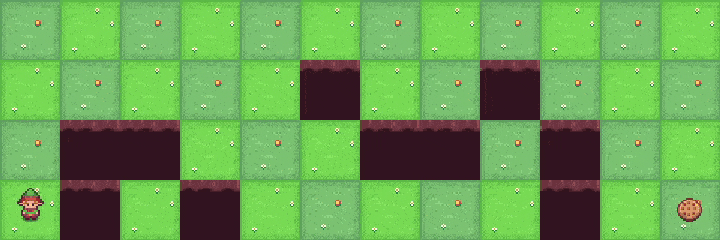
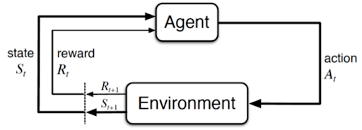
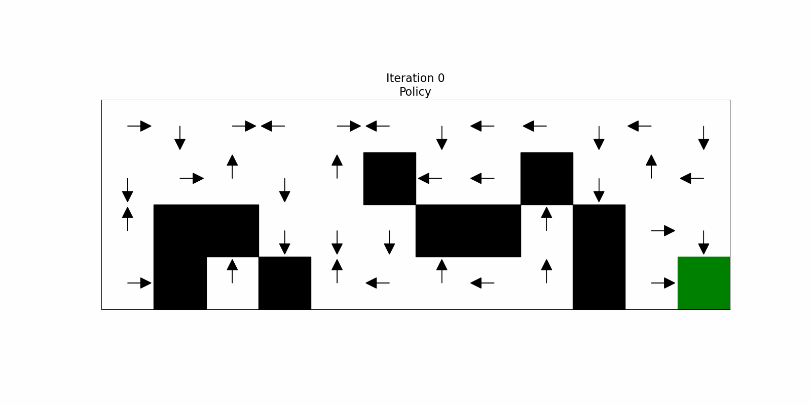
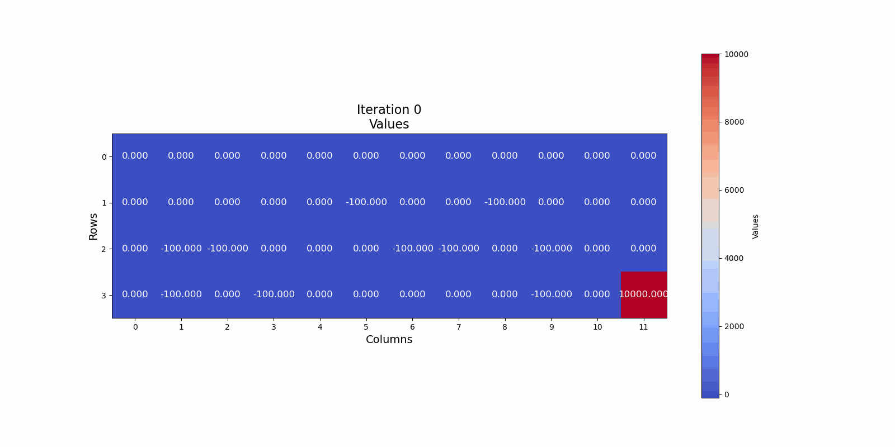
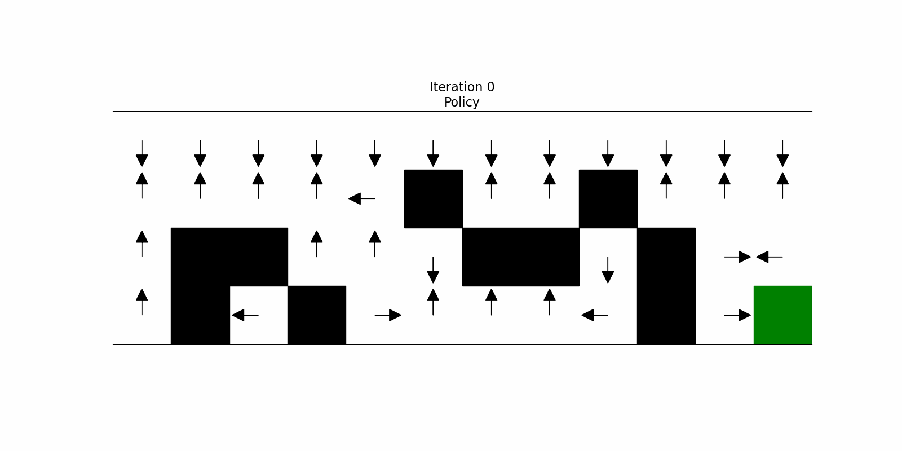
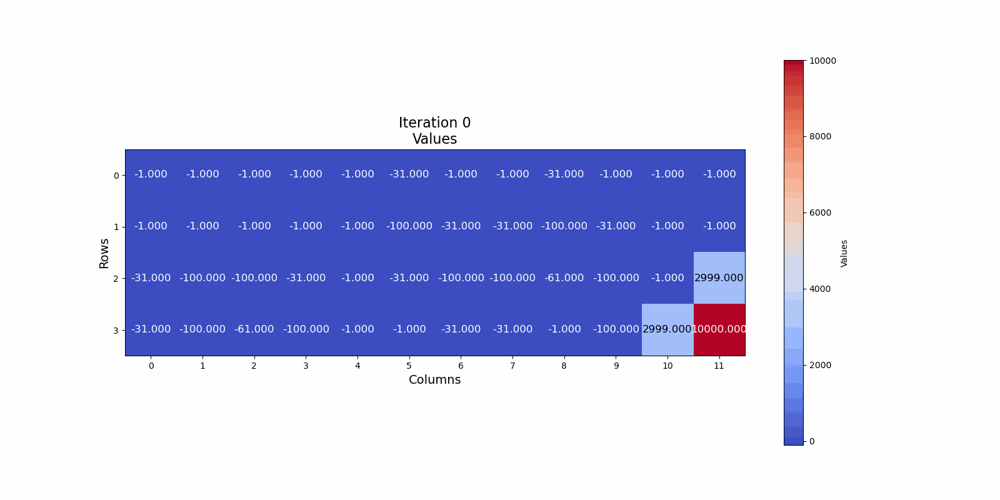

# Cliff Walking MDP Visualizations

This project implements a Cliff Walking environment and demonstrates two classic dynamic programming algorithms for Markov Decision Processes (MDPs): **Policy Iteration** and **Value Iteration**. The algorithms are implemented using a custom Agent class that builds on the OpenAI Gymnasium toy-text environment for Cliff Walking. As the algorithms run, their iterative history is captured and later rendered as animated GIFs to visualize how the policy and value function evolve over iterations.

---

## Background

### Markov Decision Processes (MDPs)

An MDP is defined by:
- A set of states, **S**
- A set of actions, **A**
- A transition probability function, **P(s'|s,a)**
- A reward function, **R(s,a,s')**
- A discount factor, **γ** (gamma)

The goal in an MDP is to find a policy **π** (a mapping from states to actions) that maximizes the expected cumulative reward.

### Policy Evaluation and Policy Iteration

According to *Artificial Intelligence: A Modern Approach (4th Edition)* by Peter Norvig and Stuart Russell, **policy evaluation** is the process of computing the value function for a given policy **π**. This is achieved by solving the Bellman expectation equation:

$$
V^\pi(s) = \sum_{s'} P(s'|s,\pi(s)) \left[ R(s,\pi(s),s') + \gamma\, V^\pi(s') \right]
$$

In **policy iteration**, the algorithm alternates between:
1. **Policy Evaluation:** Compute $ V^\pi $ for the current policy.
2. **Policy Improvement:** Update the policy using:
   
   $$
   \pi'(s) = \arg\max_a \sum_{s'} P(s'|s,a) \left[ R(s,a,s') + \gamma\, V^\pi(s') \right]
   $$
   
This process repeats until the policy converges.

### Value Iteration

The **value iteration** algorithm combines policy evaluation and improvement in a single update step using the Bellman optimality equation:

$$
V_{k+1}(s) = \max_a \sum_{s'} P(s'|s,a) \left[ R(s,a,s') + \gamma\, V_k(s') \right]
$$

The optimal policy is then derived by choosing the action that maximizes the expected value:

$$
\pi^*(s) = \arg\max_a \sum_{s'} P(s'|s,a) \left[ R(s,a,s') + \gamma\, V^*(s') \right]
$$

These formulations are well described in *Artificial Intelligence: A Modern Approach (4th Edition)*, which provides a comprehensive treatment of MDPs and dynamic programming techniques.

---

## Implementation in the Project

### Agent Class

The project’s `Agent` class encapsulates both policy iteration and value iteration:

- **Policy Iteration:**
  - **Policy Evaluation:** The agent iteratively computes the value function $ V^\pi(s) $ until convergence, using a fixed tolerance as the stopping criterion.
  - **Policy Improvement:** The policy is updated state-by-state by selecting the action that maximizes the expected value based on the current $ V^\pi $.

- **Value Iteration:**
  - The value function is updated in a loop using the Bellman optimality equation. The iteration stops when the maximum change across all states falls below a specified threshold.

Both algorithms account for special terminal states (such as the goal and cliff states) by “freezing” their values to fixed rewards.

### Visualization

The project visualizes the iterative history of the algorithms by rendering:
- **Policy Grids:** Showing the directional decisions at each state.
- **Value Grids:** Displaying the evolving value function as a heatmap.

Animated GIFs are generated to provide an intuitive view of how the policy and value functions change over time.

**Policy Evaluation Algorithm Training History:**

*Evolution of the policy over iterations.*

*Evolution of the value function over iterations.*

**Value Iteration Algorithm Training History:**

*Evolution of the policy over iterations.*

*Evolution of the value function over iterations.*

---

## Running the Project

1. **Install Dependencies:**  
   Ensure that you have the required libraries installed (e.g., `matplotlib`, `numpy`, `gymnasium`, `Pillow`).

2. **Execute the Code:**  
   Run the main Python script that creates the Cliff Walking environment, initializes the `Agent`, runs the policy iteration and value iteration algorithms, and generates the GIFs.

3. **View the Visualizations:**  
   The output GIFs (`policy_history.gif` and `values_history.gif`) will be saved in the project directory, showing the progression of the algorithms.

---

## Contributors

This project was developed as part of a group assignment for the Fundamentals of Artificial Intelligence course at the University of Isfahan, taught by Dr. Karshenas.

**Group Members:**  
- Zahra Masoumi (Github: [@asAlwaysZahra](https://github.com/asAlwaysZahra))
- Matin Azami (Github: [@InFluX-M](https://github.com/InFluX-M))
- Amirali Lotfi (Github: [@liAmirali](https://github.com/liAmirali/))

## References

- Norvig, P., & Russell, S. (2020). *Artificial Intelligence: A Modern Approach* (4th Edition). Pearson.
- [OpenAI Gymnasium](https://github.com/Farama-Foundation/Gymnasium)

---

